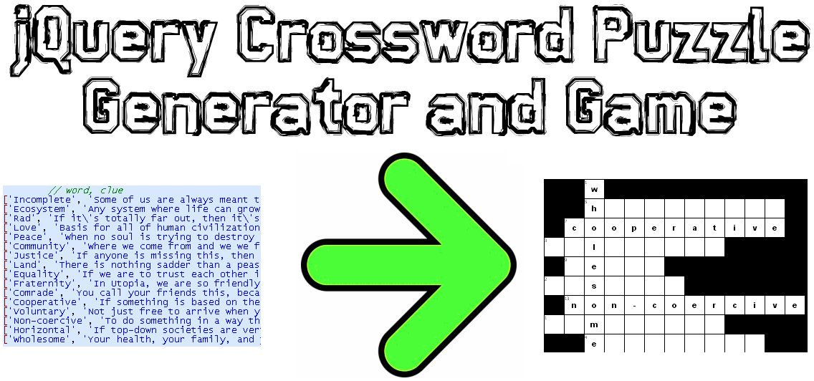

# jQuery Crossword Puzzle Generator and Game

*You* make the list of words and clues.

*We* make the puzzle and let players play!

## TOC

1. [TOC](#toc)
2. [Demo](#demo)
3. [Example Usage](#example-usage)
4. [Internationalization](#internationalization)
5. [Code Structure and Design](#code-structure-and-design)

## Demo

### Simple Demo

[100% jQuery/JavaScript Crossword Puzzle (hosted at EarthFluent.com)](http://www.earthfluent.com/crossword-puzzle-demo.html)

Demo Instructions :

* Just click the link and be amazed!
* Refresh the page a few times.  Notice the randomization patterns and the small amount of time required to generate the puzze.  It's random!  And it's fast!

### Actual Use Demo

[EarthFluent - Spanish Lessons, "Culture - Politics, Part 20"](https://www.earthfluent.com/spanish/culture-politics-part-20/view.php#games)

Demo Instructions :

- Under the "Crossword Puzzle" header, click the button reading "This Lesson", for a small crossword puzzle for just 4 words.
- If you want a much bigger crossword puzzle, click the "This Lesson + Last 10 Lessons + Next 10 Lessons" button.

## Example Usage

### Example Usage Instructions

All you need to do is:

- Include the library
- Set the `puzzlewords` variable
- And call the `crosswordPuzzle()` function

### Example Usage Code

~~~~
$(document).ready(function(event) {
	var puzzlewords = [
			// word, clue
		['Incomplete', 'Some of us are always meant to be this.'],
		['Ecosystem', 'Any system where life can grow and thrive.'],
		// ... etc..
	];
	crosswordPuzzle(puzzlewords);
});
~~~~

## Internationalization

We have full UTF-8 support for all languages, from Latin-based languages to Sanskritic languages to Sino-Tibetan languages.  Here are some examples in 12 different languages.

### European Language Demos

* [**Spanish** Crossword Puzzle Game for Learning Spanish: "Nouns - Concepts, Part 35"](https://www.earthfluent.com/spanish/nouns-concepts-part-35/play.php?action=CrosswordPuzzle&previousquizzes=10) --- [Full Lesson Page](https://www.earthfluent.com/spanish/nouns-concepts-part-35/#games) 
* [**French** Crossword Puzzle Game for Learning French: "Nouns - Concepts, Part 35"](https://www.earthfluent.com/french/nouns-concepts-part-35/play.php?action=CrosswordPuzzle&previousquizzes=10) --- [Full Lesson Page](https://www.earthfluent.com/french/nouns-concepts-part-35/#games)
* [**Italian** Crossword Puzzle Game for Learning Italian: "Nouns - Concepts, Part 35"](https://www.earthfluent.com/italian/nouns-concepts-part-35/play.php?action=CrosswordPuzzle&previousquizzes=10) --- [Full Lesson Page](https://www.earthfluent.com/italian/nouns-concepts-part-35/#games)
* [**German** Crossword Puzzle Game for Learning German: "Nouns - Concepts, Part 35"](https://www.earthfluent.com/german/nouns-concepts-part-35/play.php?action=CrosswordPuzzle&previousquizzes=10) --- [Full Lesson Page](https://www.earthfluent.com/german/nouns-concepts-part-35/#games)
* [**Dutch** Crossword Puzzle Game for Learning Dutch: "Nouns - Concepts, Part 35"](https://www.earthfluent.com/dutch/nouns-concepts-part-35/play.php?action=CrosswordPuzzle&previousquizzes=10) --- [Full Lesson Page](https://www.earthfluent.com/dutch/nouns-concepts-part-35/#games)
* [**Polish** Crossword Puzzle Game for Learning Polish: "Nouns - Concepts, Part 35"](https://www.earthfluent.com/polish/nouns-concepts-part-35/play.php?action=CrosswordPuzzle&previousquizzes=10) --- [Full Lesson Page](https://www.earthfluent.com/polish/nouns-concepts-part-35/#games)
* [**Portuguese** Crossword Puzzle Game for Learning Portuguese: "Nouns - Concepts, Part 35"](https://www.earthfluent.com/portuguese/nouns-concepts-part-35/play.php?action=CrosswordPuzzle&previousquizzes=10) --- [Full Lesson Page](https://www.earthfluent.com/portuguese/nouns-concepts-part-35/#games)

### Asian Language Demos

* [**Japanese** Crossword Puzzle Game for Learning Japanese: "Nouns - Concepts, Part 35"](https://www.earthfluent.com/japanese/nouns-concepts-part-35/play.php?action=CrosswordPuzzle&previousquizzes=10) --- [Full Lesson Page](https://www.earthfluent.com/japanese/nouns-concepts-part-35/#games)
* [**Chinese** Crossword Puzzle Game for Learning Chinese: "Nouns - Concepts, Part 35"](https://www.earthfluent.com/chinese/nouns-concepts-part-35/play.php?action=CrosswordPuzzle&previousquizzes=10) --- [Full Lesson Page](https://www.earthfluent.com/chinese/nouns-concepts-part-35/#games)
* [**Hindi** Crossword Puzzle Game for Learning Hindi: "Nouns - Concepts, Part 35"](https://www.earthfluent.com/hindi/nouns-concepts-part-35/play.php?action=CrosswordPuzzle&previousquizzes=10) --- [Full Lesson Page](https://www.earthfluent.com/hindi/nouns-concepts-part-35/#games)
* [**Indonesian** Crossward Puzzle Game for Learning Indonesian: "Nouns - Concepts, Part 35"](https://www.earthfluent.com/indonesian/nouns-concepts-part-35/play.php?action=CrosswordPuzzle&previousquizzes=10) --- [Full Lesson Page](https://www.earthfluent.com/indonesian/nouns-concepts-part-35/#games)
* [**Russian** Crossword Puzzle Game for Learning Russian: "Nouns - Concepts, Part 35"](https://www.earthfluent.com/russian/nouns-concepts-part-35/play.php?action=CrosswordPuzzle&previousquizzes=10) --- [Full Lesson Page](https://www.earthfluent.com/russian/nouns-concepts-part-35/#games)
* [**Korean** Crossword Puzzle Game for Learning Korean: "Nouns - Concepts, Part 35"](https://www.earthfluent.com/korean/nouns-concepts-part-35/play.php?action=CrosswordPuzzle&previousquizzes=10) --- [Full Lesson Page](https://www.earthfluent.com/korean/nouns-concepts-part-35/#games)

## Code Structure and Design

### Coding Languages

The entire project is coded in the following...

* *JavaScript* - For generating the crossword puzzle from a list of words.
* *jQuery* - For making an interactive game with a generated crossword puzzle.
* *CSS* - For stylizing the grid-form of the crossword puzzle.
* *HTML* - For providing the framework that the jQuery and CSS work upon.

### Design Values

A crossword puzzle is a grid, and we assign each x-y coordinate of this grid the following values:

* **High Value (2)** : A grid slot that has a letter for a word that is *across* and a word that is *down*.
* **Medium Value (1)** : A grid slot that has a letter for just one word, whether it is *across* or *down*.
* **No Value (0)** : A grid slot that is black and cannot be filled in.

A crossword puzzle's value can be summarized using the values above and summing the results of the coordinates.  If we wanted to pursue this even more thoroughly, we would assign a negative value to "No Value."

### Design Principles

Understanding these values, our engineering design principles therefore make the following suggestions about code development...

* **Spine Words** : A word that runs through a group of another words will be 100% high-value letters.  They are like a spine through which a rib runs through at each interval.  Maximize these.
* **Compacting** : If we can remove an all black-column or an all-black row by shifting words around the grid, then do so.  Since the grid starts at x/y coordinates of 0/0, the crossword puzzle builds to the rightward and downward, so that means we must compact leftward and upward.

### Design Requirements

* Code must be **fast**.
* Code must be **readable**.
* Code must be **amenable** and **adaptable** to improvements geared toward the Design Principles.

### Design Terminology

Much of this brief glossary owes itself to tradition, but some is new.

* **Across** : Either describing a word or a list which runs in the horizontal direction (left to right, or, in some languages, right to left).
* **Down** : Similarly either describing a word or a list, but one which runs in the vertical diretion (top to bottom, or, in some languages, bottom to top).
* **Spine Word** : A word among a group of words, that shares some, most, or all of its letters with the others.  For example, the word "up" is a spine word for the group of words "under, pan, up", because "u" is shared with "under" and "p" is shared with "pan."
* **Matrix / Grid / Graph** : Shorthand for describing the crossword puzzle.
* **Matrix Cell / Grid Cell / Graph Cell** : Shorthand for describing a cell of a crossword puzzle.

### Grid Cell Use Cases

* A grid slot of the crossword puzzle is the start location of a word from the *across* list.
* A grid slot of the crossword puzzle is the start location of a word from the *down* list.
* A grid slot of the crossword puzzle is the start location of a word from the *across* list and a word from the *down* list.

### crossword-puzzle.js - Technical Overview

#### Set Randomization Configs

* `areWeInGodMode()`
     * Turn on to show the crossword puzzle completed, which makes debugging and coding much easier.
* `areWeRandomizingPuzzleWords()`
    * On/off switch for determining whether we randomize the puzzle words themselves (to increase the randomness of the overall resultant crossword puzzle).
* `areWeRandomizingPuzzlePieces()`
    * On/off switch for determining whether we are randomizing the puzzle pieces themselves, similarly to increase randomness.
* `areWeRandomizingAcrossDownChoices()`
    * On/off switch for determining if we are randomizing "spine" words from being either *across* or *down*.
* `areWeRandomizingAcrossDownLists()`
    * On/off switch for determining if we randomize choices of the *across* and *down* phrase lists.

#### main()

* `crosswordPuzzle(puzzlewords)`
    * Main function that receives the list of puzzlewords and then displays the crossword puzzle itself.

#### User Form Actions

* `showCrossWordOptions()`
    * Show the crossword puzzle and the lists.
    * `solvefunction()`
        * User clicked the "solve" button for a phrase on the *across* or *down* list.  Provide a prompt for solving the clue.
    * `closesolvefunction()`
        * User clicked "close" on the "solve phrase" dialogue that was brought up by `solvefunction()`.
    * `answerfunction()`
        * User clicked "answer" on the "solve phrase" dialogue that was brought up by `solvefunction()`.
    * `revealanswerfunction()`
        * User clicked "reveal answer" on the "solve phrase" dialogue that was brought up by `solvefunction()`.

#### Show Crossword Lists

* `showCrossWordLists(wordlists, clues)`
    * Fill in the numbers for the crossword puzzle and then display the lists of words associated with those numbers.
* `getViewableCrossWordList(listitems, clues, across)`
    * Get a single crossword list, which may be used for either *across* or *down* lists.
* `fillInCrossWordNumbers(listitems, blockitems, blockitemsordered)`
    * Fill in the numbers in the crossword puzzle boxes that are each individually associated with a particular clue from the *across* or *down* lists.
* `getBlockingItemNumber(coordinates, blockitems, blockitemsordered)`
    * It is possible for a grid cell to be the start position for one item from the *across* list and one item from the *down* list.  In this case, a "blocking number" is already assigned to the grid cell.  We resolve this by placing the number on the opposite side in the cell, so all cells have a number in the top-left corner, but this one has a number in the top-left and the top-right.
    * This function gets that blocking item number.
* `getBlockItemNumberPosition(word, items)`
    * This returns the number position of the blocking item.

#### Show Crossword Puzzle

* `showCrossWordPuzzle(matrix)`
    * Show the crossword puzzle itself.  Only display the answers if we are in god mode.
* `buildCrosswordLists(matrixpositions)`
    * From the crossword puzzle, build the lists of *across* and *down*.
* `buildCrosswordList(list, positions)`
    * Build a single crossword list, either for *across* or *down*.

#### Build Crossword Puzzle

* `buildCrosswordBlockGraphs(graphs)`
    * Given groups of words, each with a "spine" word, assemble these into a single crossword puzzle block graph.
* `interpolateMatrixPositions(matrixpositions, coordinates, word)`
    * Shift the entire matrix of crossword puzzle words by some coordinates.  For example,  move each row up by 1 and left by 5, which would retain the relationship among the words, since they are all moved by the same amount and in the same directions.
* `viewPuzzle(puzzle)`
    * Debugging tool to view the puzzle.
* `rtrim(string)`
    * Right-trim a string.
* `joinHorizontalMatrices(fullmatrix, matrix, coordinates)`
    * Given two matrices of crossword puzzle graphs, join them horizontally.
* `joinVerticalMatrices(bigmatrix, smallmatrix)`
    * Given two matrices of crossword puzzle graphs, join them vertically.
* `nonConflictingRows(toprow, bottomrow)`
    * Are these two rows without conflicts between each other?  A conflict is when one of the words from one row touch the words of another row (which breaks the crossword puzzle rule that only corners and edges may be the origin of a word, and never the center of the grid block).
* `incrementMatrixHorizontally(matrix)`
    * Add another blank column to the crossword puzzle grid.
* `checkToBuildVertically(matrix, smallmatrix, widestline, tallestline)`
    * Should we build vertically?  We should do so if the crossword puzzle is wider than it is taller, which will give us the most compact crossword puzzle possibility.
* `randomTrueFalse()`
    * Random yes/no generator.
* `getWidestLine(matrix)`
    * Given a matrix, returns the widest line.
* `getThinnestLine(matrix)`
    * Given a matrix, returns the thinnest line.  This is the line with the most amount of black space to its right.
* `getTallestLine(matrix)`
    * Given a matrix, return the tallest line.  This is the line with the least amount of blank space below it.
* `buildCrosswordBlocks(crosswordblocks)`
    * Build groups of words, each with one spine word.
* `buildUnassignedCrosswordBlock(unmatchedcrosswords)`
    * At the end of making our groups of words with spine words, we have smoe that could not be matched at all.  Group these together as a block.
* `insertLetterAtStringPosition(letter, string, position)`
    * Arrays are immutable within JavaScript.  So, this method allows us to edit strings by inserting letters at positions.
* `setLetterMatrixHorizontally(matrix, word, y, x)`
    * Build a graph from a group of words horizontally.
* `setLetterMatrixVertically(matrix, word, y, x)`
    * Build a group from a group of words vertically.
* `findMatchingOffset(word, letter)`
    * Find the position of a letter in a word.
* `findMatchingLetterMatrixPositionVertical(matrix, word, subletter, index)`
    * Find the vertical position of a letter.
* `findMatchingLetterMatrixPosition(matrix, word, subletter, index)`
    * Find the horizontal position of a letter.
* `fillLetterMatrixVertically(matrix, word, index)`
    * Fill a matrix with the appropriate amount of white space to make it into a perfect rectangular block.
* `buildUnmatchedBlock(unmatchedblock)`
    * Compose the unmatched block.  Since nothing matches, there's nothing to build here.
* `getLongestWordLength(words)`
    * Get the length of the longest word.
* `compactCrosswordBlockSources(graphs)`
    * Compact the graphs that will be used to make the full crossword puzzle graph.
* `compactCrosswordBlockSource(graph)`
    * Compact a single crossword block source graph.
* `compactCrosswordBlockTop(graph)`
    * Compact the crossword block from the top.
* `incrementCrossWordBlockHeights(crosswordblocksolutions)`
    * Increase the vertical position of the words in a crossword block by one.
* `incrementCrossWordBlockLengths(crosswordblocksolutions)`
    * Increase the horizontal position of the words in a crossword block by one.
* `compactCrosswordBlockBottom(graph)`
    * Compact a crossword block on the bottom.
* `compactCrosswordBlockLeft(graph)`
    * Compact a crossword block on the left.
* `compactCrosswordBlockRight(graph)`
    * Compact a crossword block on the right.
* `generateCrosswordBlockSources(shuffledwords)`
    * Make the crossword block sources, which are the sub-graphs or mini-graphs.  These will be put together to make the full crossword puzzle.
* `getLettersHashPositionsForWord(word)`
    * Get a hash of the letters and the positions of the letters of a word.
* `getLettersHashCountForWord(word)`
    * Get a hash of the counts for the letters of a word.
* `getMatchingLetter(letters, nextword)`
    * Get the matching letter between two overlapping words.
* `shuffle(array)`
    * Randomize array.
